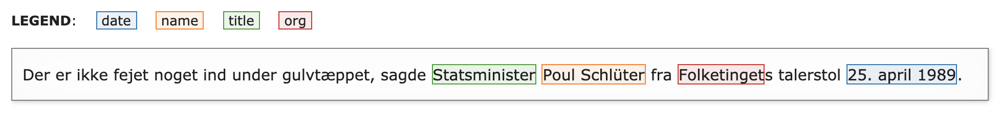

# NER doccano utilities

## Example data

### `danish.json`

```python
[
    {
        'text': 'Og så skyder han. Nej, han venter. Jaaaa, Michael Laudrup. Det er genialt, dét der!',
        'labels': [[42, 57, 'name']]
    },
    {
        'text': 'Der er ikke fejet noget ind under gulvtæppet, sagde Statsminister Poul Schlüter fra Folketingets talerstol 25. april 1989.',
        'labels': [[52, 65, 'title'], [66, 79, 'name'], [84, 95, 'org'], [107, 121, 'date']]
    },
    {
        'text': 'Lige ud af Næstved - ikke af betonen. Det er der, jeg er født og vokset op!',
        'labels': [[11, 18, 'city']]
    },
    {
        'text': 'DEN HÆSLIGE BY.\n\nSkrig er udspændt mellem husene\ni den hæslige by\nMenneskene er skygger\naf fabrikkerne og kontorerne,\nEn pige løfter sin kjole\nog hendes køn er et ur\nFragmenter af endnu fri bevidsthed\nhænger som en tåge i luften\nkun gennemlyst af neonøjnene\nGennem gaderne flaxer anskudte drømme\nmed vinger som vimpler af visnende blade\nI byens udkant ligger sindssygehospitalet\nhvor hvide patienter udvexler diagnoser,\nsmerte og medicin\nI det fjerneste rum\nligger den bedøvede drift\nfastspændt til en stinkende våd seng\nI dansehallen midt i byen danses Dødedisco\nDe midlertidige masker udleveres ved indgangen\nmod aflevering af visse hjernedele\nomfattende minder om barndom, kærlighed\nog drift mod stjerner og oprør.\n\nVi folder drømmens faner ud (1981) - Michael Strunge',
        'labels': [[748, 752, 'year'], [756, 771, 'name']]
    }
]
```

## Utilities

### `load_json_lines()`

```python
doccano_data = load_json_lines('examples/danish.json')
```

```python
len(doccano_data)

output:
4
```

```python
type(doccano_data)

output:
list
```

```python
doccano_data[1]

output:
{'text': 'Der er ikke fejet noget ind under gulvtæppet, sagde Statsminister Poul Schlüter fra Folketingets talerstol 25. april 1989.',
 'labels': [[52, 65, 'title'], [66, 79, 'name'], [107, 121, 'date']]}
```

### `extract_entities()`

```python
extract_entities(doccano_data[1])

output:
{'title': ['Statsminister'],
 'name': ['Poul Schlüter'],
 'date': ['25. april 1989']}
```

```python
extract_entities(doccano_data[1], include_indices=True)

output:
{'title': [(52, 65, 'Statsminister')],
 'name': [(66, 79, 'Poul Schlüter')],
 'date': [(107, 121, '25. april 1989')]}
```

### `Tokenizers()`

```python
models = Tokenizers(spacy_lang_class='da', bert_model='bert-base-multilingual-cased')
```

### `tokenize()`

```python
tokenize(
    doccano_document=doccano_data[1],
    tokenizers=models
)

output:
[(0, 3, 'Der'),
 (4, 6, 'er'),
 (7, 11, 'ikke'),
 (12, 14, 'fe'),
 (14, 17, '##jet'),
 (18, 23, 'noget'),
 (24, 27, 'ind'),
 (28, 33, 'under'),
 (34, 37, 'gul'),
 (37, 39, '##vt'),
 (39, 40, '##æ'),
 (40, 44, '##ppet'),
 (44, 45, ','),
 (46, 48, 'sa'),
 (48, 51, '##gde'),
 (52, 56, 'Stat'),
 (56, 65, '##sminister'),
 (66, 70, 'Poul'),
 (71, 73, 'Sc'),
 (73, 75, '##hl'),
 (75, 79, '##üter'),
 (80, 83, 'fra'),
 (84, 88, 'Folk'),
 (88, 92, '##etin'),
 (92, 95, '##get'),
 (95, 96, '##s'),
 (97, 101, 'tale'),
 (101, 104, '##rst'),
 (104, 106, '##ol'),
 (107, 109, '25'),
 (109, 110, '.'),
 (111, 116, 'april'),
 (117, 121, '1989'),
 (121, 122, '.')]
```

### `distribute_labels()`

```python
distribute_labels(doccano_data[1], tokens)

output:
['',
 '',
 '',
 '',
 '',
 '',
 '',
 '',
 '',
 '',
 '',
 '',
 '',
 '',
 '',
 'title',
 'title',
 'name',
 'name',
 'name',
 'name',
 '',
 'org',
 'org',
 'org',
 '',
 '',
 '',
 '',
 'date',
 'date',
 'date',
 'date',
 '']
```

### `iob()`

```python
iob(labels)

output:
['O',
 'O',
 'O',
 'O',
 'O',
 'O',
 'O',
 'O',
 'O',
 'O',
 'O',
 'O',
 'O',
 'O',
 'O',
 'B-TITLE',
 'I-TITLE',
 'B-NAME',
 'I-NAME',
 'I-NAME',
 'I-NAME',
 'O',
 'B-ORG',
 'I-ORG',
 'I-ORG',
 'O',
 'O',
 'O',
 'O',
 'B-DATE',
 'I-DATE',
 'I-DATE',
 'I-DATE',
 'O']
```

### `doccano_to_iob_tokens()`

```python
doccano_to_iob_tokens(
    doccano_document=doccano_data[1],
    tokenizers=models
)

output:
[('Der', 'O'),
 ('er', 'O'),
 ('ikke', 'O'),
 ('fe', 'O'),
 ('##jet', 'O'),
 ('noget', 'O'),
 ('ind', 'O'),
 ('under', 'O'),
 ('gul', 'O'),
 ('##vt', 'O'),
 ('##æ', 'O'),
 ('##ppet', 'O'),
 (',', 'O'),
 ('sa', 'O'),
 ('##gde', 'O'),
 ('Stat', 'B-TITLE'),
 ('##sminister', 'I-TITLE'),
 ('Poul', 'B-NAME'),
 ('Sc', 'I-NAME'),
 ('##hl', 'I-NAME'),
 ('##üter', 'I-NAME'),
 ('fra', 'O'),
 ('Folk', 'B-ORG'),
 ('##etin', 'I-ORG'),
 ('##get', 'I-ORG'),
 ('##s', 'O'),
 ('tale', 'O'),
 ('##rst', 'O'),
 ('##ol', 'O'),
 ('25', 'B-DATE'),
 ('.', 'I-DATE'),
 ('april', 'I-DATE'),
 ('1989', 'I-DATE'),
 ('.', 'O')]
```


### `display_annotations()`

```python
display_annotations(
    doccano_document=doccano_data[1],
    break_lines=True
)
```



### `split_doc_into_sentences()`

```python
document = doccano_data[0]['text']
split_doc_into_sentences(
    document=document,
    tokenizers=models,
    MAX_LEN=128
)

output:
[['DE', '##N', 'H', '##Æ', '##SL', '##IG', '##E', 'BY', '.'],
 ['S',
  '##kr',
  '##ig',
  'er',
  'ud',
  '##sp',
  '##æ',
  ... <-- (hiding 100 tokens)
  '##ler',
  'dia',
  '##gnose',
  '##r',
  ',',
  'sm',
  '##erte'],
 ['og',
  'med',
  '##ici',
  '##n',
  'I',
  'det',
  'f',
  ... <-- (hiding 67 tokens)
  'st',
  '##jerne',
  '##r',
  'og',
  'op',
  '##rør',
  '.'],
 ['Vi',
  'f',
  '##old',
  '##er',
  'dr',
  '##ømme',
  '##ns',
  'fan',
  '##er',
  'ud',
  '(',
  '1981',
  ')',
  '-',
  'Michael',
  'St',
  '##rung',
  '##e']]

```